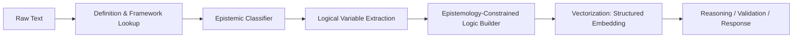
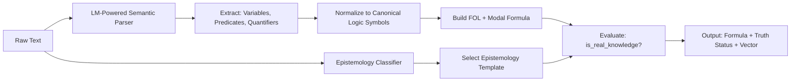

### بسم الله الرحمن الرحيم

---
موضوعات: #projects #ML #منطق #الفلسفه #epistemology #ai_logic #neurosymbolic #islamic_realism
2025-12-14 - 00:34
بعض الموضوعات المشابهه: [[000 - خريطة العقل والذكاء (Intellect MOC)]] [[003 - خريطة المنهجية والعلم (Epistemology & Methodology MOC)]]




```python
# epistemology_data.py

EPISTEMOLOGY_DATASET = []

# ───────────────────────────────
# 1. NATURALISM (Materialist Monism)
# ───────────────────────────────
naturalism_examples = [
    "All phenomena, including consciousness, are ultimately reducible to physical processes.",
    "Only entities postulated by our best scientific theories should be considered real.",
    "There is no supernatural; everything that exists is part of the natural world.",
    "Moral values are evolutionary adaptations, not objective truths.",
    "The mind is what the brain does—nothing more.",
    "If it cannot be measured or observed, it does not exist.",
    "Science is the only reliable path to knowledge; all else is speculation.",
    "Human behavior is fully determined by genes and environment.",
    "Religious experience is a neurological phenomenon.",
    "Reality is exhausted by space, time, matter, and energy."
]
EPISTEMOLOGY_DATASET.extend((text, "naturalism") for text in naturalism_examples)

# ───────────────────────────────
# 2. EMPIRICISM (Senses as sole source)
# ───────────────────────────────
empiricism_examples = [
    "All knowledge originates in sensory experience.",
    "We are born as blank slates; experience writes upon them.",
    "Ideas are copies of impressions derived from the senses.",
    "Without observation, there can be no science.",
    "Concepts not traceable to sense data are meaningless.",
    "Experiment is the final arbiter of truth.",
    "Theories must be grounded in observable data.",
    "Intuition without empirical verification is unreliable.",
    "Scientific knowledge is built from inductive generalizations over observations.",
    "Perception is the foundation of all human understanding."
]
EPISTEMOLOGY_DATASET.extend((text, "empiricism") for text in empiricism_examples)

# ───────────────────────────────
# 3. RATIONALISM (Intellect reveals necessary truths)
# ───────────────────────────────
rationalism_examples = [
    "Mathematical truths are discovered, not invented—they exist independently of minds.",
    "2 + 2 = 4 is true in all possible worlds, regardless of human belief.",
    "Logic and mathematics provide knowledge of necessary, universal truths.",
    "The principles of reason are more certain than sensory evidence.",
    "We possess innate ideas that structure all experience.",
    "Geometric axioms are known through intellectual intuition, not measurement.",
    "Truths of reason are eternal and unchanging.",
    "The laws of thought are the foundation of all knowledge.",
    "Philosophy, like mathematics, proceeds by deductive rigor from self-evident axioms.",
    "Abstract objects such as numbers have real existence."
]
EPISTEMOLOGY_DATASET.extend((text, "rationalism") for text in rationalism_examples)

# ───────────────────────────────
# 4. IDEALISM (Reality is mental/spiritual)
# ───────────────────────────────
idealism_examples = [
    "To be is to be perceived; objects exist only insofar as they are experienced.",
    "The material world is an appearance within consciousness.",
    "Reality is fundamentally mental or spiritual in nature.",
    "The external world is a construct of the mind.",
    "All that exists are minds and their ideas.",
    "Matter is an illusion; only spirit is real.",
    "The universe is the manifestation of absolute mind.",
    "Perception actively constitutes reality, rather than passively receiving it.",
    "Objects have no existence independent of a perceiving subject.",
    "The world is the self-expression of divine consciousness."
]
EPISTEMOLOGY_DATASET.extend((text, "idealism") for text in idealism_examples)

# ───────────────────────────────
# 5. RELATIVISM (No objective truth)
# ───────────────────────────────
relativism_examples = [
    "Truth is always relative to a cultural or historical context.",
    "There are no universal moral principles—only local norms.",
    "Scientific theories are social constructs, not discoveries of reality.",
    "What is 'true' for one community may be 'false' for another—and both are valid.",
    "Knowledge is shaped by power structures, not objective reality.",
    "All perspectives are equally valid; no worldview is privileged.",
    "Facts do not exist—only interpretations.",
    "Morality is a matter of personal or cultural preference.",
    "Reality is linguistically constructed; there is no 'world-in-itself'.",
    "Objectivity is an illusion masking subjective interests."
]
EPISTEMOLOGY_DATASET.extend((text, "relativism") for text in relativism_examples)

# ───────────────────────────────
# 6. ISLAMIC REALISM (Your Epistemology)
#    Based on classical usul al-fiqh, kalam, and contemporary Islamic philosophy
# ───────────────────────────────
islamic_realism_examples = [
    "True knowledge (al-ʿilm al-ḥaqq) is that which corresponds to the divine order (niẓām ilāhī).",
    "The sound intellect (al-ʿaql al-salīm), when guided by revelation, perceives metaphysical realities.",
    "Philosophy is valid when it serves tawḥīd and is purified from materialist assumptions.",
    "The universe is a book of signs (āyāt) pointing to the Creator—studied through both reason and scripture.",
    "Ethical truths are objective because they reflect the Divine Command, not human convention.",
    "Knowledge is real only if it is grounded in divine reality (al-ḥaqq) and aligned with fitrah.",
    "Science investigates the 'how' of creation; revelation reveals the 'why'—both are complementary when properly ordered.",
    "The intellect and revelation are two wings of the human soul; neither suffices alone.",
    "Metaphysical knowledge—such as the existence of God—is attainable through rational demonstration (burhān).",
    "Real knowledge requires three conditions: sound senses, sound intellect, and sound transmission (khabar ṣādiq).",
    "Philosophy, when rooted in tawḥīd and purified by revelation, yields certain knowledge of universal truths.",
    "The human intellect, by its nature, recognizes necessary truths because it participates in the Divine Intellect.",
    "Empirical data must be interpreted through the lens of divine revelation to attain real knowledge.",
    "Without divine grounding, even mathematical certainty lacks ultimate ontological foundation.",
    "The fitrah (primordial nature) inclines the human being toward recognition of tawḥīd and moral truth."
]
EPISTEMOLOGY_DATASET.extend((text, "islamic_realism") for text in islamic_realism_examples)

# epistemology_classifier.py
import torch
from transformers import DistilBertTokenizer, DistilBertForSequenceClassification
from sklearn.preprocessing import LabelEncoder
from torch.utils.data import DataLoader, TensorDataset
import numpy as np

class EpistemologyClassifier:
    def __init__(self, model_name="distilbert-base-uncased", num_epochs=3):
        self.device = torch.device("cuda" if torch.cuda.is_available() else "cpu")
        self.tokenizer = DistilBertTokenizer.from_pretrained(model_name)
        self.label_encoder = LabelEncoder()
        
        # Prepare data
        texts, labels = zip(*EPISTEMOLOGY_DATASET)
        encoded_labels = self.label_encoder.fit_transform(labels)
        self.num_labels = len(self.label_encoder.classes_)
        
        # Tokenize
        encodings = self.tokenizer(
            texts,
            truncation=True,
            padding=True,
            max_length=64,
            return_tensors="pt"
        )
        
        dataset = TensorDataset(
            encodings["input_ids"],
            encodings["attention_mask"],
            torch.tensor(encoded_labels)
        )
        dataloader = DataLoader(dataset, batch_size=4, shuffle=True)
        
        # Model
        self.model = DistilBertForSequenceClassification.from_pretrained(
            model_name, num_labels=self.num_labels
        ).to(self.device)
        
        # Train (tiny data → few epochs)
        self._train(dataloader, num_epochs)
        self.model.eval()

    def _train(self, dataloader, epochs):
        optimizer = torch.optim.AdamW(self.model.parameters(), lr=2e-5)
        self.model.train()
        for epoch in range(epochs):
            for batch in dataloader:
                input_ids, attention_mask, labels = [b.to(self.device) for b in batch]
                outputs = self.model(input_ids, attention_mask=attention_mask, labels=labels)
                loss = outputs.loss
                loss.backward()
                optimizer.step()
                optimizer.zero_grad()

    def predict(self, text: str) -> str:
        inputs = self.tokenizer(
            text,
            return_tensors="pt",
            truncation=True,
            padding=True,
            max_length=64
        ).to(self.device)
        
        with torch.no_grad():
            outputs = self.model(**inputs)
            probs = torch.softmax(outputs.logits, dim=-1)
            pred_idx = torch.argmax(probs, dim=-1).item()
            confidence = probs[0][pred_idx].item()
        
        pred_label = self.label_encoder.inverse_transform([pred_idx])[0]
        return pred_label, confidence

import re
import numpy as np
from sentence_transformers import SentenceTransformer  # Lightweight semantic encoder
 # Your BERT classifier

class IntellectAgent:
    def __init__(self):
        # Load lightweight semantic encoder (runs on CPU, ~50MB)
        self.semantic_model = SentenceTransformer('all-MiniLM-L6-v2')
        self.epi_classifier = EpistemologyClassifier()
        
        # Logical variable counter
        self.var_counter = 0
        self.concept_to_var = {}

    def _get_var(self, concept: str) -> str:
        """Map concept to logical variable (e.g., 'math' → M1)"""
        if concept not in self.concept_to_var:
            self.var_counter += 1
            self.concept_to_var[concept] = f"{concept[0].upper()}{self.var_counter}"
        return self.concept_to_var[concept]

    def _extract_logical_elements(self, text: str):
        # Normalize
        text = re.sub(r"[^\w\s]", " ", text.lower())
        words = text.split()
        
        # Simple predicate extraction: "A is B", "A relate to B"
        elements = []
        for i, word in enumerate(words):
            if word in ("is", "are", "relate", "related", "equals", "means"):
                if i > 0 and i < len(words) - 1:
                    subj = words[i-1]
                    obj = words[i+1]
                    elements.append(("pred", subj, obj))
            elif word == "not":
                if i < len(words) - 1:
                    elements.append(("neg", words[i+1]))
        return elements

    def _build_formula(self, text: str, epi: str) -> str:
        """Build epistemology-constrained logical formula"""
        elements = self._extract_logical_elements(text)
        if not elements:
            return "No logical structure detected."

        # Detect modal cues
        is_necessary = any(w in text.lower() for w in ["100%", "always", "necessarily", "must"])
        is_empirical = any(w in text.lower() for w in ["observe", "measure", "experiment", "data"])
        is_revealed = any(w in text.lower() for w in ["revealed", "quran", "god", "divine"])

        # Build predicates
        preds = []
        for elem in elements:
            if elem[0] == "pred":
                _, a, b = elem
                var_a = self._get_var(a)
                var_b = self._get_var(b)
                preds.append(f"{var_a} = {var_b}")

        formula_base = " ∧ ".join(preds) if preds else "True"

        # Epistemology-specific framing
        if epi == "rationalism":
            # Math/logic = necessary, non-empirical truths
            return f"□({formula_base})" if is_necessary else f"◇({formula_base})"
        elif epi == "naturalism":
            # All truth must be reducible to physical/scientific
            return f"∀x ({formula_base} → Physical(x))"
        elif epi == "islamic_realism":
            # Truth requires divine grounding
            return f"({formula_base}) ∧ DivineGrounded"
        elif epi == "empiricism":
            # Knowledge = sensory verification
            return f"{formula_base} ∧ VerifiedBySenses" if is_empirical else f"Possible({formula_base})"
        elif epi == "idealism":
            return f"{formula_base} ∧ MindDependent"
        elif epi == "relativism":
            return f"ContextDependent({formula_base})"
        else:
            return formula_base

    def _structured_vectorize(self, text: str, epi: str):
        """Create a 105D structured vector: [100 semantic + 5 epistemic]"""
        # 1. Semantic embedding (100D)
        semantic_vec = self.semantic_model.encode([text])[0]  # shape: (384,) → we'll truncate to 100
        if len(semantic_vec) > 100:
            semantic_vec = semantic_vec[:100]
        else:
            semantic_vec = np.pad(semantic_vec, (0, 100 - len(semantic_vec)))

        # 2. Epistemic metadata
        epi_code = {
            "naturalism": 0,
            "empiricism": 0,
            "rationalism": 1,
            "idealism": 1,
            "islamic_realism": 2,
            "relativism": -1
        }.get(epi, -1)

        # Divine alignment: only Islamic realism gets g=1.0
        divine_align = 1.0 if epi == "islamic_realism" else 0.0

        # Modal status
        text_lower = text.lower()
        if any(w in text_lower for w in ["impossible", "contradict", "false"]):
            modal = 0
        elif any(w in text_lower for w in ["100%", "true", "real", "necessary", "certain"]):
            modal = 2
        else:
            modal = 1

        # Quantifier strength (0=none, 1=existential, 2=universal)
        if any(w in text_lower for w in ["all", "every", "always"]):
            quant_strength = 2
        elif any(w in text_lower for w in ["some", "exists", "certain"]):
            quant_strength = 1
        else:
            quant_strength = 0

        # Combine
        epistemic_meta = np.array([epi_code, divine_align, modal, quant_strength], dtype=np.float32)
        structured = np.concatenate([semantic_vec, epistemic_meta])
        return structured

    def analyze(self, text: str):
        print(f"📝 Input: {text}")
        
        # 1. Classify epistemology
        epi, conf = self.epi_classifier.predict(text)
        print(f"🔍 Epistemology: {epi} (confidence: {conf:.2f})")
        
        # 2. Build logic formula
        formula = self._build_formula(text, epi)
        print(f"⚖️  Logical formula: {formula}")
        
        # 3. Structured vectorization
        vector = self._structured_vectorize(text, epi)
        print(f"🔢 Structured vector shape: {vector.shape}")
        print(f"   Epistemic tail: [epi_code, divine_align, modal, quant] = {vector[-4:]}")
        
        return {
            "text": text,
            "epistemology": epi,
            "epistemology_confidence": conf,
            "logical_formula": formula,
            "structured_vector": vector
        }

import re
import numpy as np
from typing import Dict, List
from sentence_transformers import SentenceTransformer

class EpistemicIntellectAnalyzer:
    # Logical concept space
    LOGICAL_CONCEPTS = ["philosophy", "numbers", "physical", "science"]
    
    # Epistemic rules
    AUTHENTIC_SOURCES = {"Quran", "Sunnah", "Ijma", "Fitrah", "SoundIntellect"}

    def __init__(self):
        self.epi_classifier = EpistemologyClassifier()
        self.semantic_model = SentenceTransformer('all-MiniLM-L6-v2')
        self.concept_to_idx = {name: i for i, name in enumerate(self.LOGICAL_CONCEPTS)}
        self.dim = len(self.LOGICAL_CONCEPTS)

    def _extract_concepts(self, text: str) -> Dict[str, float]:
        """Extract presence of logical concepts (binary for now)"""
        text_lower = text.lower()
        concepts = {}
        for concept in self.LOGICAL_CONCEPTS:
            # Simple matching (extend with NER or definitions later)
            if concept in text_lower:
                concepts[concept] = 1.0
            else:
                concepts[concept] = 0.0
        return concepts

    def _text_to_vector(self, text: str) -> np.ndarray:
        """Convert text to logical vector in [philosophy, numbers, physical, science]"""
        concepts = self._extract_concepts(text)
        vec = np.array([concepts.get(c, 0.0) for c in self.LOGICAL_CONCEPTS])
        return vec

    def _is_science(self, vec: np.ndarray) -> bool:
        return vec[self.concept_to_idx["science"]] > 0.5

    def _is_real_knowledge(self, vec: np.ndarray, epi: str, text: str) -> bool:
      text_lower = text.lower()
      
      if epi == "islamic_realism":
          # Real knowledge if: 
          # - It involves intellect/philosophy AND 
          # - Mentions divine grounding, revelation, or sound intellect
          has_phil_or_intellect = vec[self.concept_to_idx["philosophy"]] > 0.5
          has_divine_cue = any(w in text_lower for w in [
              "divine", "revelation", "god", "quran", "sound intellect", "fitrah", "guided", "truth"
          ])
          return has_phil_or_intellect and has_divine_cue

      elif epi in ["naturalism", "empiricism"]:
          return self._is_science(vec)

      elif epi == "rationalism":
          return vec[self.concept_to_idx["numbers"]] > 0.5  # math = real

      else:
          return False

    def analyze_text(self, text: str):
        print(f'📝 Input: "{text}"\n')
        
        # 1. Predict epistemology
        epi, conf = self.epi_classifier.predict(text)
        print(f"🔍 Predicted Epistemology: {epi} (confidence: {conf:.2f})\n")

        # 2. Build logical vectors
        full_vec = self._text_to_vector(text)
        
        # Special: "numbers and physical"
        v_numbers = np.zeros(self.dim)
        v_numbers[self.concept_to_idx["numbers"]] = 1.0
        v_physical = np.zeros(self.dim)
        v_physical[self.concept_to_idx["physical"]] = 1.0
        v_N_and_H = np.minimum(v_numbers, v_physical)  # element-wise AND

        # Philosophy vector: assume "philosophy" is declared as [1,0,0,0]
        v_philosophy = np.zeros(self.dim)
        v_philosophy[self.concept_to_idx["philosophy"]] = 1.0

 
        # 3. Print evaluation (your requested format)
        print(f"v_N_and_H = {v_N_and_H}")
        print(f"\n=== Vector Evaluation ===")
        print(f"Philosophy vector : {v_philosophy.astype(int)}")
        print(f"Is philosophy science? → {self._is_science(v_philosophy)}")
        print(f"Norm of philosophy vector: {np.linalg.norm(v_philosophy):.1f}")
        is_real = self._is_real_knowledge(v_philosophy, epi, text) 
        print(f"But as knowledge ({epi}-aligned): {'REAL' if is_real else 'NOT REAL'}")

        print(f"\n=== Conclusion ===")
        print(f"Philosophy is real knowledge? {is_real}")

        return {
            "epistemology": epi,
            "philosophy_vector": v_philosophy,
            "is_real_knowledge": is_real
        }

if __name__ == "__main__":
    analyzer = EpistemicIntellectAnalyzer()
    
    # Your classic example
    text = "science is true , no philosphy"
    result = analyzer.analyze_text(text)
    
    
```


### 🌐 The Big Picture: Data Flow


[[neurosymbolic NLP]]
